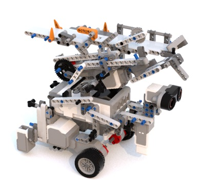

Hardware
============

The Hardware report is composed of 2 parts: Hardware Concerns and Adopted Mechanical Design

If you are interested in the implementation of the robot, please consult `Code Base`_ to get more information.

.. _Code Base: https://github.com/haoweiqiu/Thomas-The-EV3-Engine

Hardware Concerns
-----------------

HEIGHT OF THE ROBOT

- Since the height of the robot is restricted due to the presence of a tunnel on the final competition board, the launcher height needs to be considered. 

POSITION OF RUBBER TIRES

- The wheels powered by the large motors could be positioned either under the EV3 brick (along with the motors) or on the sides. Both are viable options and testing could be done to decide on which configuration to use. 

BACK-WHEEL POSITION(S) 

- Our back-wheel could be positioned in the centre of the robot towards the rear, like in the previous labs of our team members. However, another possibility is to have 2 rear-mounted wheels (1 on each side of the robot). 

Adopted Mechanical Design
-----------------

The adopted mechanical design features a two-spring launcher, a rotating US sensor powered by an EV3 Medium Motor, two color sensors on each side of the robot, two EV3 Large Motors to power the rubber wheels, and a single EV3 Large Motor to power the launcher. 

A rotating ultrasonic sensor was chosen for the adopted proposal as it provides a great alternative to having multiple sensors facing different directions, which would require running multiple threads and a lot of processing power. 

Two color sensors were placed on each side of the robot. This was done in order to allow for odometry correction. The logic behind the procedure is that the robot, if travelling on a straight path, should detect dark lines on the board on both color sensors at the same time. 

The launcher uses two similar helical extension springs to store elastic potential energy to launch the ball. It was decided to use a spring launcher as it is more precise, consistent and powerful.