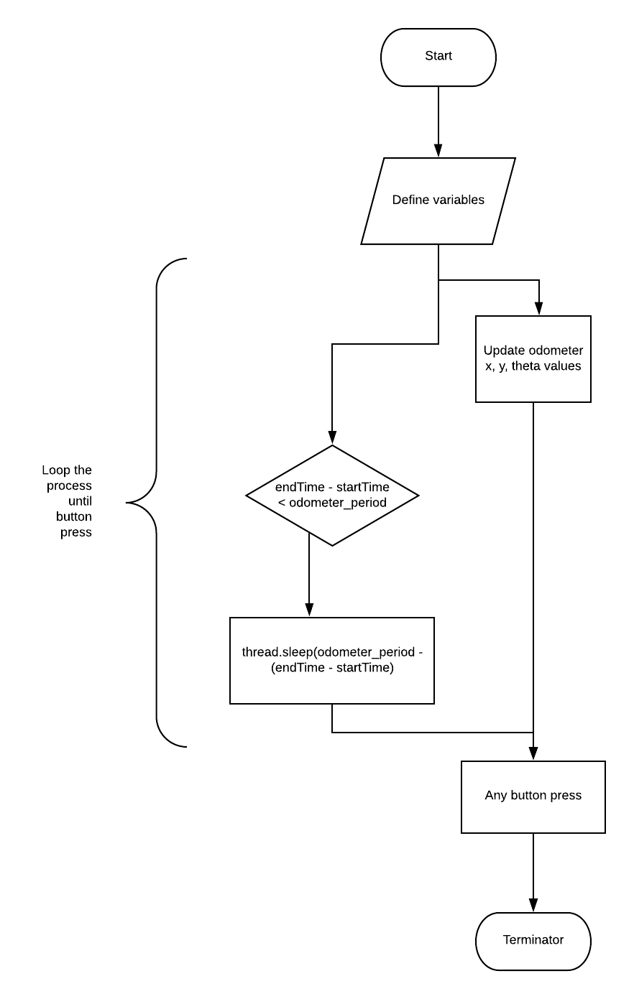
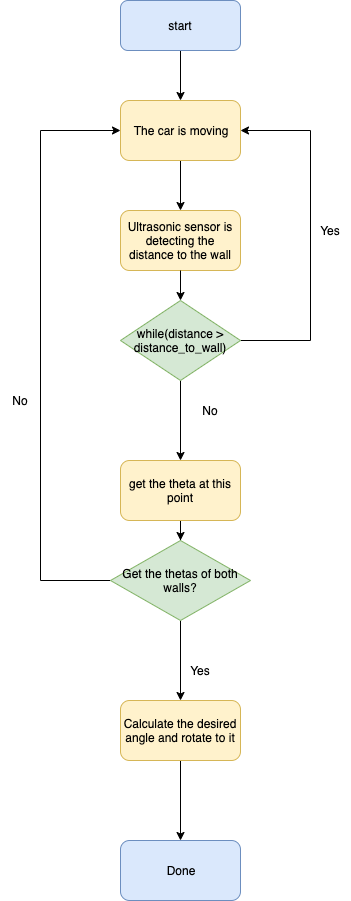
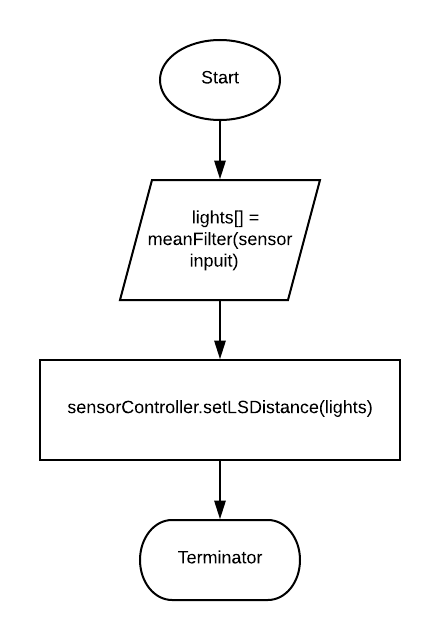
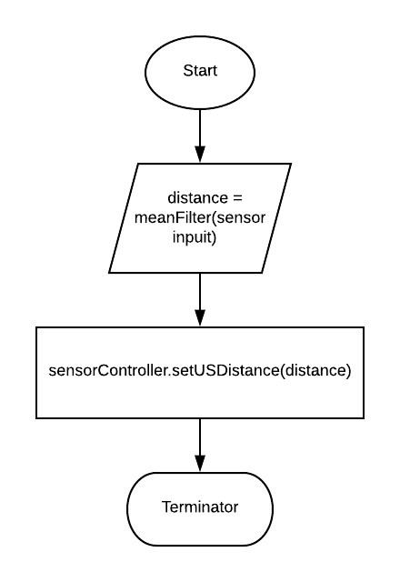
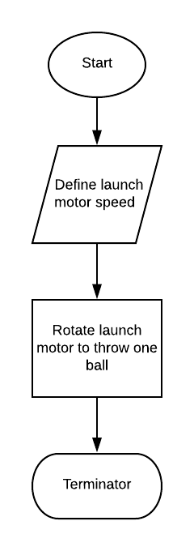

Software
============

The Software report is composed of 4 parts: Odometry, Localization, Sensors and Game.

If you are interested in the implementation of the robot, please consult `Code Base`_ to get more information.

.. _Code Base: https://github.com/haoweiqiu/Thomas-The-EV3-Engine

.. image:: images/flowchart.png
  :width: 500
  :alt: Flowchart
  :align: center

Odometry
-----------------

The Odometer keeps track of and displays the robot’s current location. To be run as a thread in the Main class.

Localization
-----------------

This method works independent from the robot’s starting position.

Ultrasonic localization

  
Light localization

- Runs after the USLocalizer. Uses the light sensor to precisely localize the robot to match the given corner (x, y, theta) coordinates obtained from the WiFi parameter. The final localized (x, y) coordinates are multiplied by TILE_SIZE.
- To localize, the axis to the right of the robot is calculated using the given WiFi corner parameter. This axis is the first localization axis. The robot then turns right to face this first axis and takes and initial sample for both left and right sensors. It then drives forward while comparing the ratio of subsequent samples with these initial samples. If one or both of the light sensor sees a ratio less than our tested differential threshold, than the odometer[firstAxis] is record. 

Sensors
-----------------

Light Poller

Ultrasonic Poller

Game
-----------------

WiFi

- Fetches data from sever before the start of the game. Gets assigned team number (red or green) as well as each team’s starting zone and tunnel boundaries. The assigned team number determines which set of data (red or green) is used for the game. The WiFi package and resources were provided to us.

Launcher

